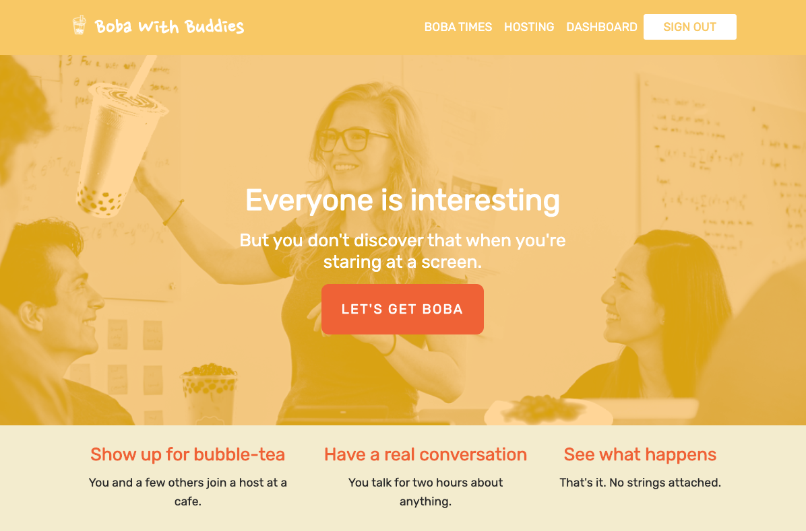
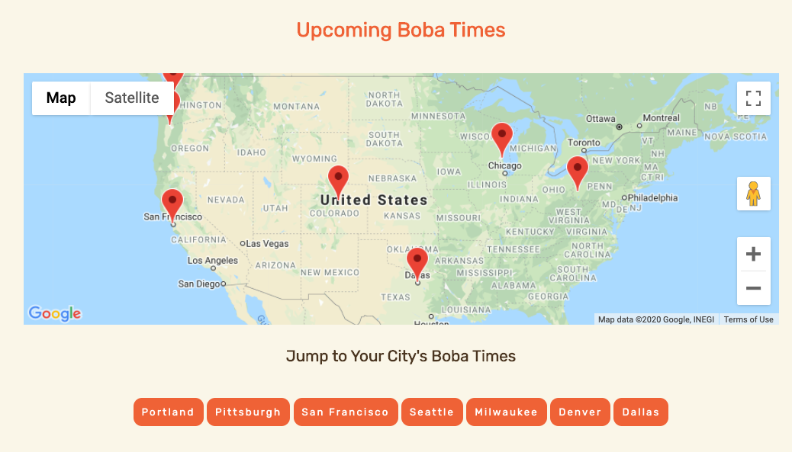
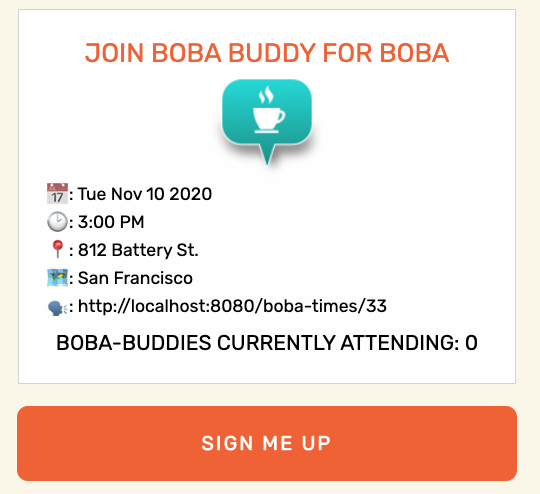
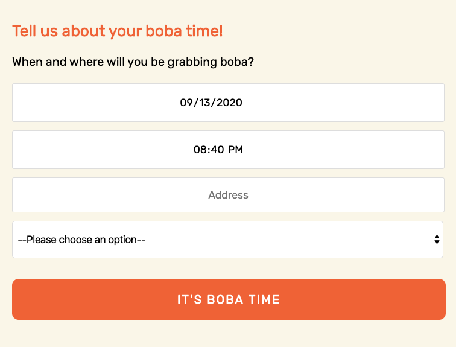
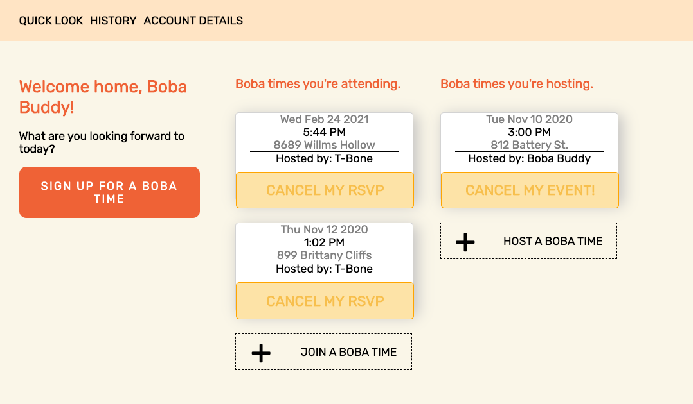

# Boba With Buddies
An app that facilitates making connections with new people—and enjoying tasty beverages together. Modeled after [Tea With Strangers](http://www.teawithstrangers.com/).

A live version of our application can be found [here](https://boba-with-buddies.herokuapp.com/).

## Team
Created by [Kasey Mcgee](https://github.com/Kmcgee92), [Juliet Shafto](https://github.com/jshafto), [Tyna William](https://github.com/tynawilliam), and [Michelle Zhang](https://github.com/MzLionheart/).

## Features
### View cities and events
Explore the collection of cities where we host events. Click on a city to see a list of upcoming events in the region.

### Join events
You can view details about an event—where it's being held, who is hosting it, and a fun description of what might be in store for you there. If you see an event you'd like to participate in, you can RSVP to it to join in the fun!

### Host events
You don't have to wait for the right event to come along—you can make the event yourself. As the event's host, you can choose the city, the spot, and the time—it's up to you what you do when you get there. Drink bubble tea, perhaps?

### Your dashboard
From your dashboard, you'll be able to view your upcoming events—the ones you're hosting and the ones you're attending. If you've had a change of plans, you can cancel your RSVP or your event. You've got a lot to look forward to.

