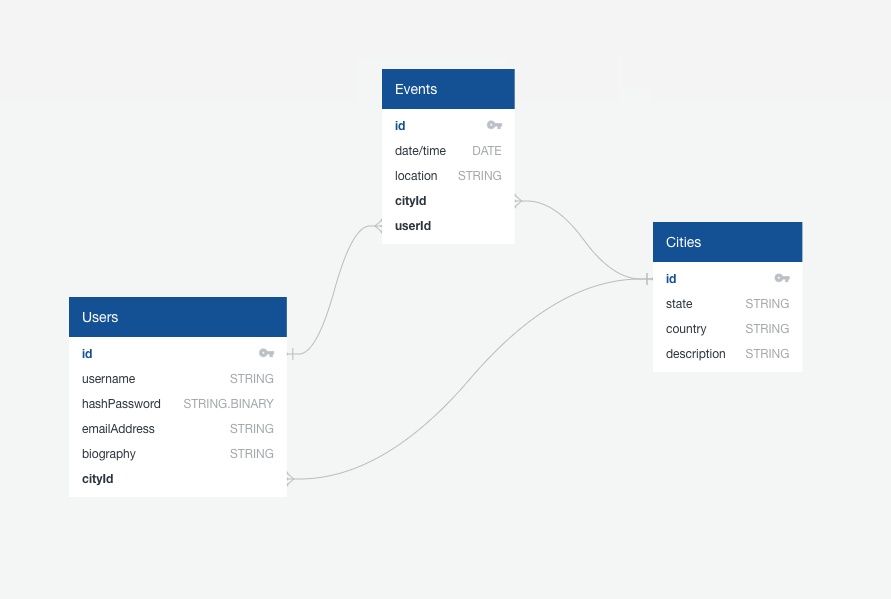

# Features
- Choose city
    - A user can explore the set of cities that are available, and access a list of all the events in that city by clicking on a city name.
- Join event
    - A user can choose to RSVP to an event, which will add the event to their dashboard.
- Host event
    - A user can create an event to host. They will specify the event name, the date/time, the city, the location, and an event description.
- Dashboard of joined events/hosted events
    - Each user has a dashboard where they can see their personal information, as well as a list of upcoming events that they are hosting or attending.

## Models
- City
    - state
    - country
    - description
- User
    - username
    - password
    - email address
    - biography
    - cityId foreign key
- Event
    - name
    - date/time
    - location (address)
    - cityId foreign key
    - userId foreign key (points to the host user)
    - description

## Endpoints
- A page that contains a list of cities. Clicking on a city fetches some information about the city, along with a table of upcoming events (name, date/time, location).
- An event detail page, which will include a button so that users can RSVP to the event. This will add the event to their dashboard.
- Create an event page, which contains a form where they specify all of the event info. Clicking the submit button will create the event so that it appears on their dashboard, and in the list of events in that city.
- Dashboard where users can view their personal details, along with a list of events they are attending, and a list of events they are hosting.

Schema:
