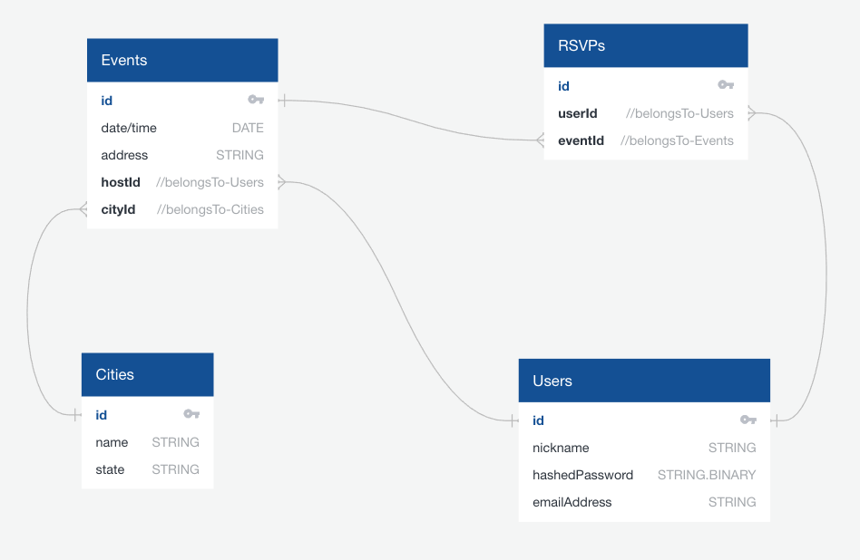

# Features

## Sign in page
### User Story:
As a registered user, I want to be able to log in.

### Goals
#### Acceptance critera
- [x] User can visit the `/signin` route and there's a form with email / password
- [x] After user enters a valid email and password they are redirected to the dashboard
- [x] If a user enters an invalid email / password, they receive a general message that there was a login error
- [x] If a user enters the wrong password, they receive a general message that there was a login error
- [x] Refreshing the page after login maintains the user session
- [ ] User can log out to end the session

## Sign up page
### User Story:
As a new user, I want to be able to create an account so that I can join and host events.

### Goals
#### Acceptance critera
- [x] User can visit the `/signup` route and there's a form with nickname / email / password
- [x] After user enters a valid nickname, a valid email address that isn't in the database already, and a valid password a new account is created for them
- [x] If a user fails to provide any of the necessary information, or if the information they provide isn't valid, they will recieve a clear error message so that they can try again
- [x] Once the new account has been created the user is redirected to their dashboard.

## View cities and events
### User Story:
As a visitor to the website, I should be able to view all of the cities where events are hosted, and access all of the events for each city.

### Goals
#### Acceptance criteria
- [x] Visitors can view the `/boba-times` route to browse the different cities where events are available
- [x] List of cities (as links or buttons) is present in a horizontal bar on the page
- [x] Clicking a link to a city displays a collection of future events from that city below the list of cities
- [x] For each event, the host, address, and number of attendees appears
- [x] Each event has button that takes you to the event details page for that event

#### Stretch goals
- [ ] Include a description of each city
- [ ] Include a picture for each city
- [ ] A map is featured of the city
- [ ] Map contains pins for each of the events

## Join event
### User Story:
As a user I want to be able to RSVP to an event, so that I can keep track of events I'm attending.

### Goals
#### Acceptance criteria
- [ ] Event detail page is located at `/boba_times/:id`
- [ ] Event detail page has all of details about an event in one place
    - the date/time
    - the location
    - the host
    - the number of attendees
- [ ] Page includes a button that will allow the user to RSVP to the event

#### Stretch goals
- [ ] Add an event name and description
- [ ] Event detail page will indicate whether or not a user is already attending the event, and if so the join button will go away
- [ ] A "Cancel RSVP" button will be available to users who are already attending the event
- [ ] A "Cancel Event" button will be available to the host of the event
- [ ] The host will be able to see the list of users who have RSVP'd yes to the event on the event detail page

## Host Event
### User Story:
As a user, I want to be able to create new events to host. I should be able to choose the name, the location, and the time.

### Goals
#### Acceptance criteria
- [ ] Create event page lets you create a new event
- Users must provide
    - [ ] an event name
    - [ ] a city (from a dropdown list that includes only the cities in our database)
    - [ ] an address (as a string)
    - [ ] a time and date
- [ ] Successful POST would redirect the user to the /events/:id event detail page for the newly created event
- [ ] Failure to provide a required field would load a list of applicable error messages

## User dashboard
### User Story:
As a user, I want to be able to view all my account details and all of my events (the ones I'm hosting, and the ones I'm attending) in one place.
### Goals
#### Acceptance criteria
- [ ] The `/dashboard` page would allow a user to view their account details and upcoming events
- [x] Dashboard greets user with nickname
- [ ] Dashboard contains a column with a list of all events the user has RSVP’d to
- [ ] Dashboard contains a column with a list of all events a user is hosting
- [ ] Each event item in both columns includes a link to the event detail page
- [ ] Dashboard contains a button that says “Join an event” which takes the user to the `/boba-times` page
- [ ] Dashboard contains a button that says “Host a new event” which takes a user to the `/hosting` page

#### Stretch goals
- [ ] Serves a random “inspirational” quote to user
- [ ] Separate past and future events (event history)

## Models
- City
    - id (primary key)
    - name
    - state
- User
    - id (primary key)
    - nickname
    - hashedPassword
    - email address
- Event
    - id (primary key)
    - name
    - date/time
    - address
    - cityId (foreign key references City.id)
    - hostId (foreign key references User.id)
    - description
- RSVPs (join table for users and events)
    - id (primary key)
    - userId (foreign key references User.id)
    - eventId (foreign key references Event.id)

# Endpoints
- pages
    - `/` - homepage
    - `/signin` - login form for registered users
    - `/signup` - sign up page for new users
    - `/boba-times` - page that lists cities and events
    - `/boba-times/:id` - event detail page
    - `/dashboard` - user dashboard (requires account)
    - `/hosting` - form for creating a new event
- api endpoints
    - GET `/api/cities`
    - GET `/api/cities/:id`
    - GET `/api/events/:id`
    - POST `/api/events/` (creates a new event with user as host)
    - POST `/api/rsvps/:id` (to add an rsvp between a given user and event)
    - POST `/api/users` (creates new user account)
    - POST `/api/users/token` (signs in existing user)

# Schema:

